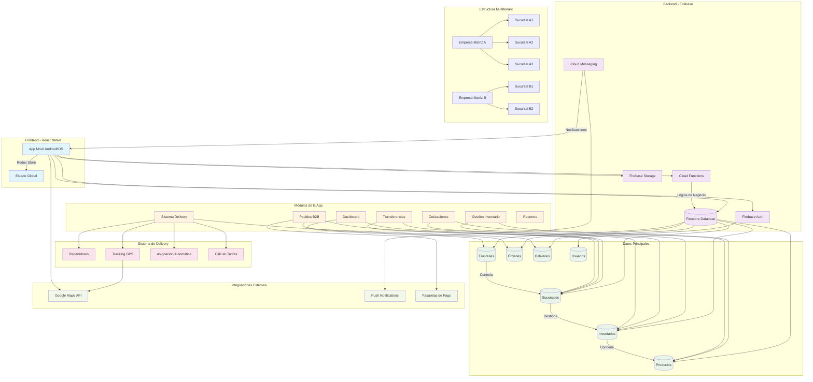

```mermaid
    graph TB
    subgraph "Frontend - React Native"
        MA[App Móvil Android/iOS]
        MA --> |Redux Store| ST[Estado Global]
    end
    
    subgraph "Backend - Firebase"
        AUTH[Firebase Auth]
        DB[(Firestore Database)]
        FUNC[Cloud Functions]
        STORAGE[Firebase Storage]
        MSG[Cloud Messaging]
    end
    
    subgraph "Estructura Multitenant"
        TENANT1[Empresa Matriz A]
        TENANT1 --> SUC1A[Sucursal A1]
        TENANT1 --> SUC1B[Sucursal A2]
        TENANT1 --> SUC1C[Sucursal A3]
        
        TENANT2[Empresa Matriz B]
        TENANT2 --> SUC2A[Sucursal B1]
        TENANT2 --> SUC2B[Sucursal B2]
    end
    
    subgraph "Datos Principales"
        COMPANIES[(Empresas)]
        BRANCHES[(Sucursales)]
        PRODUCTS[(Productos)]
        INVENTORY[(Inventarios)]
        ORDERS[(Órdenes)]
        DELIVERIES[(Deliveries)]
        USERS[(Usuarios)]
    end
    
    subgraph "Módulos de la App"
        DASH[Dashboard]
        INV[Gestión Inventario]
        ORD[Pedidos B2B]
        DEL[Sistema Delivery]
        QUOT[Cotizaciones]
        TRANS[Transferencias]
        REP[Reportes]
    end
    
    subgraph "Sistema de Delivery"
        DRIVERS[Repartidores]
        TRACKING[Tracking GPS]
        ASSIGN[Asignación Automática]
        CALC[Cálculo Tarifas]
    end
    
    subgraph "Integraciones Externas"
        MAPS[Google Maps API]
        PUSH[Push Notifications]
        PAYMENT[Pasarelas de Pago]
    end
    
    %% Conexiones principales
    MA --> AUTH
    MA --> DB
    MA --> FUNC
    MA --> STORAGE
    
    AUTH --> USERS
    DB --> COMPANIES
    DB --> BRANCHES
    DB --> PRODUCTS
    DB --> INVENTORY
    DB --> ORDERS
    DB --> DELIVERIES
    
    FUNC --> |Lógica de Negocio| DB
    MSG --> |Notificaciones| MA
    
    %% Módulos a datos
    DASH --> COMPANIES
    DASH --> BRANCHES
    INV --> INVENTORY
    INV --> PRODUCTS
    ORD --> ORDERS
    ORD --> BRANCHES
    DEL --> DELIVERIES
    DEL --> DRIVERS
    QUOT --> PRODUCTS
    QUOT --> INVENTORY
    TRANS --> INVENTORY
    TRANS --> BRANCHES
    
    %% Sistema delivery
    DEL --> TRACKING
    DEL --> ASSIGN
    DEL --> CALC
    TRACKING --> MAPS
    
    %% Integraciones
    MA --> MAPS
    MSG --> PUSH
    ORD --> PAYMENT
    
    %% Flujo multitenant
    COMPANIES --> |Controla| BRANCHES
    BRANCHES --> |Gestiona| INVENTORY
    INVENTORY --> |Contiene| PRODUCTS
    
    %% Estilos
    classDef frontend fill:#e1f5fe
    classDef backend fill:#f3e5f5
    classDef data fill:#e8f5e8
    classDef modules fill:#fff3e0
    classDef delivery fill:#fce4ec
    classDef external fill:#f1f8e9
    
    class MA,ST frontend
    class AUTH,DB,FUNC,STORAGE,MSG backend
    class COMPANIES,BRANCHES,PRODUCTS,INVENTORY,ORDERS,DELIVERIES,USERS data
    class DASH,INV,ORD,DEL,QUOT,TRANS,REP modules
    class DRIVERS,TRACKING,ASSIGN,CALC delivery
    class MAPS,PUSH,PAYMENT external

```